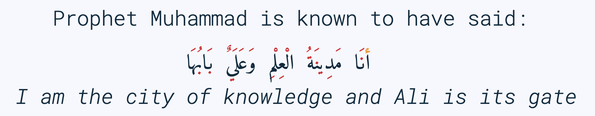

# -*- eval: (my/execute-startup-blocks) -*-
#+title: Arabic Roots: The Power of Patterns
#+modified: 2022-11-02 Wed
#+description: Let's learn about how the Arabic language makes use of “roots” to obtain various words
#+author: Musa Al-hassy
#+email: alhassy@gmail.com
#+fileimage: https://unsplash.com/photos/Ejdemp9O7Po
#+filetags: arabic javascript emacs

* Abstract :ignore:

I want to quickly introduce the Arabic language, through its “root system” ---i.e., most words have 3-letters at their
core--- and how these roots can be placed in “patterns” to obtain new words.

I'd like to take a glance at Arabic's Verb Forms: These give you 10 words for each root!

Some *green:interesting* concepts will also be mentioned, for those curious, but should be ignored on a first
reading. These will be hidden away in /clickable/foldable/ regions.

These are notes of things that I'm learning; there's likely errors.

* The Arabic Root System
:PROPERTIES:
:CUSTOM_ID: The-Arabic-Root-System
:END:

Most Arabic words are derived from a three-letter [[doc:arabic-root][root]] ---notable exceptions are words like “and” وَ
and “on” علی.  A root, or مصدر “masdar”, refers to the core meaning of a word.  Simply put, roots are identified by
ignoring all non-vowel letters, resulting in usually 3 letters ---and, rarely, 4 letters.  /Roots are the building
blocks of the Arabic language and are helpful for guessing the meaning of vocabulary./

For example, the sequence of letters س−ف−ر (read right-to-left as s-f-r) carries the meaning of “travel”.
Any word containing these letters, in this order, likely has something to do with travel. For example:

   | English    | Arabic | Transliteration |
   |------------+--------+------------ |
   | journey    | سفر     | safar           |
   | he travels | يسافر    | yusafir         |
   | amabassdor | سفير    | safeer          |
   | traveller  | مسافر    | musafir         |
   | embassy    | سفارة    | sifara          |

All of these words are derived from the root س−ف−ر, s-f-r, in this order.
/Much of Arabic grammar is concerned with how the root is manipulated to create different related meanings:
Additional letters, or vowels, modify the meaning according to different general patterns./
card:Yes

Likewise, ك−ت−ب is a root regarding “writing”, from which we can obtain numerous words:
#+html: 

# *The emphasis on root consonants means that vowels, especially short vowels, are of secondary importance.*

#+begin_details "Can't we simply just stick the roots together?"
*No.*

For example the letters ح−م−ل have the meaning of “to carry” but naively connecting the letters gives us حمل, which,
without any context, could be read as
- حَمَلَ “he carried”, or
- حُمِلْ “he was carried”!
  - ([[doc:arabic-vowels][Vowel signs ـْ ـَ ـِ ـُ]] are discussed below.)

Both of these words are specific to
1. a male person,
2. in the past, and
3. it's not clear whether the person is doing the carrying or the one being carried.

Thus حمل is far more specific than the general meaning of ح−م−ل “to carry” ---which is not itself a word, but an abstract
sequence of letters.

#+end_details

#+begin_details Irregular Roots
Irregular roots do not consist of 3 different consonants; instead, they fall into three categories:

+ Doubled roots :: where the second and third root letters are the
  same.

  − If a doubled verb is put into a form involving a sukkun ـْـ
    on the 3rd root, then the 2nd and 3rd letters are written
    separately; otherwise, the 2nd and 3rd letters are written together
    with a shadda ـّـ.

  − For example, ر−د−د “to reply” becomes رَدَّ “he replied” when placed in the
    masculine-second-person-past-tense form فَعَلَ, but becomes رَدَدْتُ “I replied” when placed in the
    first-person-past-tense form فَعَلْتُ. [[red:More on forms below!]]

  - In doubt: Doubled roots are usually written together.

+ Weak roots :: where one of the three root letters is و or ي; for example ق−و−ل “to speak”.
  - These letters are “so weak” that they change from the constant sounds و/w and ي/y to vowel
    sounds or disappear entirely, depending on the pattern the root is placed in.
  − If و‌/ي is the first root, then it almost always drops out in the present tense.
    For example, و−ص−ل “to arrive” becomes أَصِلُ “I arrive” in the first-person-present-tense
    أَفْعُلُ form. Contrast this with the regular root ك−ت−ب “to write” becoming أَكْتُبُ “I write”.

  # - If و/ي is the second root, it becomes a /short vowel/ if the form places a sukuun on the 3rd root, and otherwise it becomes a /long vowel/.

+ Hamzated roots :: where one of the root letters is hamza ء; for example ق−ر−ء “to read”.
#+end_details

** Meanings of roots :Interactive:
:PROPERTIES:
:CUSTOM_ID: Meanings-of-roots
:END:

[[card:Let's take a break]]
Enter 3 letters to get a link to Arabic words that are derived from that root:
#+begin_export html

 See: https://alhassy.github.io/AngularJSCheatSheet/ 

 <!-- ⟨0⟩ AngularJS is active for this div -->
    <!-- ⟨1⟩ Actually load AngularJS -->
    

      <!-- ⟨2⟩ The *value* of these text boxes are named “first, second, third” -->
      <input type="text" maxlength="1" size="1" ng-model="third" ng-init="third ='ب'">
      <input type="text" maxlength="1" size="1" ng-model="second" ng-init="second ='ت'">
      <input type="text" maxlength="1" size="1" ng-model="first" ng-init="first ='ك'">
      ⇨
      <!-- ⟨3⟩ Actually use the “first, second, third” values here, *whenever* they are updated! -->
      <a href="https://en.wiktionary.org/wiki/{{first}}_{{second}}_{{third}}#Derived_terms">Derived words from {{first}}-{{second}}-{{third}}</a>

#+end_export

Alternatively, [[https://arabic.fi/roots/67-42-40][this link]] provides more information, but has less roots.
* Arabic has 112 symbols and 112 sounds
:PROPERTIES:
:CUSTOM_ID: Arabic-has-112-symbols-and-112-sounds
:END:

# Vowels and consonants are added around the roots to create related words.
#
# What are Arabic's vowels?

/What are the vowels that can be added to roots to make new words?/

Arabic has 28 letters, and like cursive English, it is written with letters connected.

Each letter has 4 forms: The isolated form, the form where the letter starts a word, the form where the letter is in the
middle of a word, and the form where a letter is at the end of a word. So, Arabic has 28 * 4 = 112 distinct shapes for
its alphabet.  (Since some letters do not connect forwards, the isolated form actually does appear in written text.  For
example, او means “or” and it consists of two isolated letters.)  For example, the letter /ha/ has the following forms:
| isolated | initial | medial | final |
|----------+---------+--------+-------|
| ه        | هـ       | ـهـ     | ـه     |

If a friend texts you something funny, you reply with ههههه −−− “hahaha”.

[[card:I have a question]]
But, where are the short vowels “a”? *Arabic short vowels are generally not written!*

There are only three short vowels in Arabic: /a/, /i/ and /u/.
They are denoted by small symbols above/below letters, for example:
     | Vowel | Example | English reading |
     |-------+---------+-----------------|
     | ـَـ     | هَهَهَهَ    | hahahaha        |
     | ـُـ     | هُهُهُهُ    | huhuhuhu        |
     | ـِـ     | هِهِهِهِ    | hihihihi        |

Incidentally, the sound “h” is obtained by using the “no vowel” marker: هْـ.  So with the 3 short vowels and the fourth
symbol to indicate the absence of a vowel, there are a total of 4 * 28 = 112 sounds in Arabic.

#+begin_details Tell me more about Arabic Vowels!
Arabs /infer/ vowels from context, otherwise words alone such as حمل are ambigious: It could mean حَمَلَ “he carried” or حُمِلْ
“he was carried”.

An example sentence with vowels written:
#+attr_html: :width 90% :height 200px

#
# Prophet Muhammad is known to have said:
# | أنَا مَدِينَةُ الْعِلْمِ وَعَلَيٌ بَابُهَا                                |
# | /I am the city of knowledge and Ali is its gate/ |
#

------------------------------------------------------------------------------------------------------------------------
Arabic has only three short vowels, or حركات (literally: “movements”), which are written as small symbols above/below
letters.

| Vowel name  | Vowel sound | Arabic | English example |
|-------------+-------------+--------+-----------------|
| Fatha / فتحة  | /a/           | ـَ       | /mat/             |
| Dhamma / ظمّة | /u/           | ـُ       | /sugar/           |
| Kasra / كسرة | /i/           | ـِ       | /bit/             |

The “no vowel” marker is suukun/سكون: While هههه has its vowels guessed to be هَهَهَهَ “hahahah”, we obtain “hhhh” by using
sukkun, هْهْهْهْ.

Arabic has 3 long vowels, which are formed using specific letters /after/ the short vowels:
 | Long vowel  sound | Arabic | English example |
 |-------------------+--------+-----------------|
 | /aa/                | ـَا      | /far/             |
 | /ii/                | ـِي      | /meet/            |
 | /uu/                | ـُو      | /boot/            |

Since short vowels are normally not written, letters ا ي و play two roles: They behave as long vowels /aa,ii,uu/ (when
preceded by short vowels) and also behave as consonant sounds /a,y,w/.
 + For example, as a consonant, [[https://arabic.fi/letters/74][ي]] makes an English “y” sound; but as a long vowel it makes an “ii” sound.
 + Occasionally, /aa/ is written using ی (which is like ي but without the dots), or یٰ, rather than an
   /alif/. This always happens at the end of a word and is called /alif maqsuura/
   “broken alif”; for example علی “on” and موسیٰ “Musa”.

The following video reads all Arabic letters, where each letter is vowelised by one of the 3 short vowels. It's a really
nice video: https://www.youtube.com/embed/U1Cl6W8EEBQ?start=6.
#+end_details

card:Disagree
/Of-course, there is more to the story!/ There is the “glottal stop”, Hamza ـٔ , and other special characters and symbols
above/below letters.  So the counts of 112 are not exact.  For example, some letters, like alif ا, have the same shape
for different forms, but sometimes it can be written as ی (such as علی “on”) یٰ (such as موسیٰ “Musa”).

#+begin_details "The Arabic Hamza ـٔ is like the English Apostrophe ـ'"
# /Hamza/ ء is a “half” letter; it can be written in a variety of ways: By itself on the line ء or carried by an /alif/
# أ or by /ya/ یٔ/ـٔـ or by /waw/ ؤ.

     1. In both cases there is uncertaininty as to when and how to use it, even among native speakers.
     2. Whereas in English we ask ourselves: /Should the apostrophe come before the “s” or after the “s”?/, in Arabic the
        question becomes: /Which letter should carry the hamza?/.
     3. The hamza itself is considered a consonant, not a vowel, pronounced as a short pause.
     4. Like the apostrophe, the rules for hamza are more concerned with where to place it than how to pronounce it.
     5. General rules:
        - At the start of a word, hamza is written on an alif: أ
        - This might result in two alifs side-by-side, if so then merge them
          into /alif madda/ آ, which is read as a long /aa/ sound.
        - Otherwise, the letter carrying the hamza tends to relate to the vowel /before/ the hamza:
          If we have ـُـ ، ـِـ ، ـَـ before the hamza, then the hamza is written ؤ ، یٔ/ـٔـ ، أ respectively.
          - If we have ـْـ before the hamza, we write ؤ ، یٔ/ـٔـ ، أ
            depending on the vowel the hamza root should be taking.
            For example, س−ء−ل “to ask” becomes يسْأَل “he asks” in the
            masculine-second-person-present-tense (يَفْعَلُ form, for this
            particular root).
#+end_details

The following video reads all Arabic letters, where each letter is vowelised by one of the 3 short vowels. It's a really
nice video.
#+html: 
<iframe width="560" height="315" src="https://www.youtube.com/embed/U1Cl6W8EEBQ?start=6" title="YouTube video player" frameborder="0" allow="accelerometer; autoplay; clipboard-write; encrypted-media; gyroscope; picture-in-picture" allowfullscreen></iframe>

* ف−ع−ل : The template for any 3 core root letters
:PROPERTIES:
:CUSTOM_ID: ف-ع-ل-The-template-for-any-3-core-root-letters
:END:

As a symbol to represent the three root letters of any word, Arabic grammar uses the roots of the prototypical verb فعل
“to do”, read /fa'al/.

For example, the root ك−ت−ب is associated with “writing”.  The word for “office” مَكْتَب is the مَفْعَل-pattern: The root
letters have مَـ before them, a sukkun ـْـ over the first root letter, and a fatha ـَـ over the second root letter. In the
same way, “books” كُتُب is the فُعُل-pattern.

[[card:Let's take a break]]
Below are some example patterns.  /If you are faced with an Arabic word that you have never heard before, you can guess
the meaning by its root and pattern./

** The فَعَّال-pattern: “the person whose job is X”
:PROPERTIES:
:CUSTOM_ID: The-فَعَّال-pattern-the-person-whose-job-is-X
:END:
This pattern gives the profession associated with a core root. Here's some examples:

| Profession     | Core meaning   |
|----------------+----------------|
| كَتَّاب            | ك−ت−ب        |
| Scribe         | to write       |
|----------------+----------------|
| فَنَّان             | ف−ن−ن         |
| Artist         | to be artistic |
|----------------+----------------|
| خَبَّاز            | خ−ب−ز         |
| Baker          | to bake        |
|----------------+----------------|
| عَطَّار            | ع−ط−ر          |
| Perfume vendor | to perfume     |
|----------------+----------------|
| رَكَّاض           | ر−ك−ظ          |
| Runner         | to run         |
|----------------+----------------|
| جَرَّاح            | ج−ر−ح          |
| Surgeon        | to cut         |
|----------------+----------------|

** The مَفعَل-pattern: “the place where X is done”
:PROPERTIES:
:CUSTOM_ID: The-مَفعَل-pattern-the-place-where-X-is-done
:END:

This pattern gives the place associated with a core root. Here's some examples:

| Place          | Core meaning |
|----------------+--------------|
| مَسكَن           | س−ك−ن       |
| home           | to live      |
|----------------+--------------|
| مَكتَب           | ك−ت−ب      |
| office         | to write     |
|----------------+--------------|
| مَدخَل           | د−خ−ل        |
| entrance       | to enter     |
|----------------+--------------|
| مَخبَز             | خ−ب−ز       |
| bakery         | to bake      |
|----------------+--------------|
| مَعبَر             | ع−ب−ر       |
| crossing point | to cross     |
|----------------+--------------|
| مَسبَح            | س−ب−ح      |
| swimming pool  | to swim      |

** TODO COMMENT The مِفعَال-pattern: “the tool used to do X” :Not_Urgent:
:PROPERTIES:
:CUSTOM_ID: The-مِفعَال-pattern-the-tool-used-to-do-X
:END:

Arabic words with the pattern Instrument noun.

| Tool | Core meaning  |
|------+---------------|
| مِنشَار  | ن−ش−ر −      |
| Saw  | to distribute | <--- Maybe not a great example.

** TODO COMMENT The فَعَيْل-pattern: “the cute, small, X”  :Not_Urgent:
:PROPERTIES:
:CUSTOM_ID: COMMENT-The-فَعَيْل-pattern-the-cute-small-X
:END:

This is known as the dimunative. For example, in English we say /ducky/ to refer to a small duck ---whereas /duckling/ also
means a small duck, but it is more formal.

| Dimunative | Original word |
|------------+---------------|

* Verb Forms: The True Power of Arabic's Form System

# If you see a word, you can guess at its meaning by recognising which form it is in and what its root is.

The richness of Arabic is based on its system of word roots, and nowhere is this more evident than in the verb system. card:Agree

In English we can add extra letters to form different but connected meanings ---for example: /value, revalue, validate/.
Arabic takes this principle much farther with many different patterns that add meaning to the origninal root form.
These /derived/ forms are the major way in which Arabic achieves its richness of vocabulary. For example, from ق−ت−ل “to
kill”, we can obtain
| he killed                         | قتل  | qatala     |
| he massacred (“killed intensely”) | قتّل  | qattala    |
| he battled (“tried to kill”)      | قاتل  | qaatala    |
| they fought each other            | تقاتلوا | taqaataluu |

Here are the significant verb forms. For simplicitly, I'm presenting them in the /past tense/ using the root ف−ع−ل “to
do”.
| Form      | Common Meanings                                       | Example                                                      |
|-----------+-------------------------------------------------------+--------------------------------------------------------------|
| 1.  [[https://arabic.tripod.com/Verbs01.htm#:~:text=or%20has%20done.-,1)%20Fa%22al(a),-The%20first%20structure][فَعَلَ]]    | “doing an action X”; (this is the most basic form)    | كَتَبَ “he wrote” from ك−ت−ب “to write”                       |
|-----------+-------------------------------------------------------+--------------------------------------------------------------|
| 2.  [[https://arabic.tripod.com/VerbForms1.htm#:~:text=Form%20II%20of%20Arabic%20Verbs][فَعَّلَ]]    | “doing X to another”; “making another do X”           | خَرّجَ “he made someone go-out/graduate” from خ−ر−ج “to go out” |
|           | “doing X intensely/repeatedly”                        | كَسَّرَ “he smashed” from ك−س−ر “to break”                      |
|-----------+-------------------------------------------------------+--------------------------------------------------------------|
| 3.  [[https://arabic.tripod.com/VerbForms1.htm#:~:text=Form%20III%20of%20Arabic%20Verbs][فَاعَلَ]]   | “doing X with someone else”                           | جَالَسَ “he sat with (someone)” from ج−ل−س “to sit”            |
|           | “trying to do X”                                      | سَابَقَ “he raced” from س−ب−ق “to come before”                 |
|-----------+-------------------------------------------------------+--------------------------------------------------------------|
| 4.  [[https://arabic.tripod.com/VerbForms2.htm#:~:text=Form%20IV%20of%20Arabic%20Verbs][أَفْعَلَ]]   | [[doc:arabic-transitive][Transitive]] meaning: “doing X to another”; like Form-2 | أَسْخَنَ “he heated (something)” from س−خ−ن “to be hot”          |
|-----------+-------------------------------------------------------+--------------------------------------------------------------|
| 5.  [[https://arabic.tripod.com/VerbForms4.htm#:~:text=Form%20V%20of%20Arabic%20Verbs][تَفَعَّلَ]]   | “doing X to yourself”; this is Form-2 + تَـ             | تَذَكَّرَ “he remembered” from ذ−ك−ر “to remind”                   |
|-----------+-------------------------------------------------------+--------------------------------------------------------------|
| 6.  [[https://arabic.tripod.com/VerbForms4.htm#:~:text=Form%20VI%20of%20Arabic%20Verbs][تَفَاعَلَ]]   | “doing X together (as a group)”; this is Form-3 + تَـ   | تَعَاوَنَ “he cooperated” from ع−و−ن “to help”                     |
|-----------+-------------------------------------------------------+--------------------------------------------------------------|
| 7.  [[https://arabic.tripod.com/VerbForms2.htm#:~:text=Form%20VII%20of%20Arabic%20Verbs][اِنْفَعَلَ]]   | [[doc:arabic-passive][Passive]] meaning: “to be X-ed”. This is Form-1 + اِنْـ     | اِنْحَمَلَ “he was carried” from ح−م−ل “to carry”                   |
|-----------+-------------------------------------------------------+--------------------------------------------------------------|
| 8.  [[https://arabic.tripod.com/VerbForms3.htm][اِفْتَعَلَ]]   | No consistent meaning;  “to make yourself do X”       | اِفْتَعَلَ “he incited” from ف−ع−ل “to do”                         |
|-----------+-------------------------------------------------------+--------------------------------------------------------------|
| 9.  [[https://arabic.tripod.com/VerbForms5.htm#:~:text=Form%20IX%20of%20Arabic%20Verbs][اِفْعَلَّ]]   | ‌used for changing colours: “to turn colour X”         | اِحْمَرَّ “he blushed / turned-red” from أحمر “red”                   |
|-----------+-------------------------------------------------------+--------------------------------------------------------------|
| 10.  [[https://arabic.tripod.com/VerbForms5.htm#:~:text=Form%20X%20of%20Arabic%20Verbs][اِسْتَفْعَلَ]] | “asking for X”; this is nearly Form-1 + اِسْتَـ            | اِسْتَعْلَمَ “he inquired” from ع−ل−م “to know”                      |
|           | “to consider or find something to have quality X”     | اِسْتَحْسَنَ “he admired” from ح−س−ن “to be beautiful”             |
|-----------+-------------------------------------------------------+--------------------------------------------------------------|

- *Exercise!* Place the roots ع−م−ل into all of these patterns, except form-9; then guess their meanings!  ( [[https://en.wiktionary.org/wiki/%D8%B9_%D9%85_%D9%84#Derived_terms][Solution]] )
- [[https://www.almaany.com/en/dict/ar-en/%D8%AC%D9%8E%D8%A7%D9%84%D9%8E%D8%B3%D9%8E][AlManny.com]] is an excellent online dictionary to finding out the meanings of words when placing them in these forms.

#+begin_details "All the derived forms do not exist for all roots, but most roots have at least one or two forms in general circulation."

1. You'll need to look in a dictionary, or the above root-meaning tool, to know exactly which forms exist.

2. There are an additional 5 forms, but they are super rare in usage.

3. In addition, Arabic speakers will sometimes make up new verbs from existing roots, either as a joke or in an
   effort to be creative or /✨poetic💐/.
#+end_details
* Closing & Useful Resources
:PROPERTIES:
:CUSTOM_ID: useful-resource-https-arabic-fi
:END:

I've often seen introductions to Arabic mention the power of roots & patterns, but one usually has to work through a
host of fundamental topics before actually seeing some of these patterns.

I've written this brief introduction so that one can actually see some of these patterns in action.

It's been a lot of fun ---I had to learn a lot more than I thought I knew to make this happen.
/It seems writing about things forces you to understand them better!/

Anyhow, I'm going to keep writing about Arabic since it seems fun and I'd like to have a way to quickly review my notes
on what I'm learning.

** Resources

+ [[https://www.amazon.ca/Mastering-Arabic-Grammar-Mahmoud-Wightwick/dp/1403941092][Mastering Arabic Grammar]] by Jane Wightwick & Mahmoud Gaafar

  Perhaps the most accessible book I've seen on Arabic grammar.

  It's a small book, whose chapters are also small/focused and digestible.

  It assumes you're familiar with the Arabic alphabet and takes you to forming
  full sentences, and reading short stories.

+ https://arabic.fi/

  Almost every word in every sentence and phrase on this website is
  clickable, and takes you to a page with generous information about the
  word, along with audio clips. It's a free, beautiful, interactive website.

+ [[http://allthearabicyouneverlearnedthefirsttimearound.com/wp-content/uploads/2014/03/All-The-Arabic-Searchable-PDF.pdf][All The Arabic You Never Learned The First Time Around (PDF)]]

  This seems like a very good book.

+ [[http://oerabic.llc.ed.ac.uk/?p=2756][OERabic]]

  OERabic is an ambitious initiative that aims to enhance the mastering of Arabic by creating bespoke creative learning
  (and teaching) resources.

* Appendix: Arabic Input Setup
:PROPERTIES:
:CUSTOM_ID: Arabic-Input-Setup
:END:

# :Maybe_make_its_own_article:

** Intro :ignore:
[[card:I have a question]] How was this article written?  [[https://www.spacemacs.org/][Emacs]]!

On the /left/ below is what I type, and on the /right/ is what you see in this article (which include hover/tooltips for the
cards).

--------------------------------------------------------------------------------
#+begin_org-demo :result-color "white" :source-color "white"
[[card:I have a question]] How was this article written? green:Emacs!

card:Yes With Emacs, I type /phonetically/ (based on sounds) to get Arabic; e.g.,
typing  *musy$ alHsaIY* gives me *موسیٰ الحسائي*, my name /Musa Al-hassy/.
#+end_org-demo

Moreover, this is how Arabic looks like within Emacs:

#+CAPTION: This is how Arabic looks like within Emacs. (Old Arabic did not have any of the coloured symbols; not even the dots!)
#+attr_html: :width 90% :height 200px

:Source_ShantyTheme:
     Prophet Muhammad is known to have said:
                أنَا مَدِينَةُ الْعِلْمِ وَعَلَيٌ بَابُهَا
  /I am the city of knowledge and Ali is its gate/
:End:

--------------------------------------------------------------------------------

The rest of this section details my [[https://www.spacemacs.org/][Emacs]] setup.

** The /look/ within Emacs
:PROPERTIES:
:CUSTOM_ID: The-look-within-Emacs
:END:
#+begin_src emacs-lisp
;; Makes all dots, hamza, diadiract marks coloured!
(set-fontset-font "fontset-default" '(#x600 . #x6ff) "Amiri Quran Colored")
#+end_src

#+begin_details "How did I find this font?"

1. Look for a font I like on  https://fonts.google.com/?subset=arabic
2. =brew search amiri=
   - Look to see if there is a font associated with it
3. =brew install font-amiri=
   - Install the likely candidate
4. =(set-fontset-font "fontset-default" '(#x600 . #x6ff) "Amiri Quran Colored")=
   - Get the full name by: Emacs -> Options -> Set Default Font
#+end_details

#+begin_details "Why even bother with this line?"

I found that I personally need the above doc:set-fontset-font line, since
I was typing the phrase
  | اهلاً وسهلاً                                 |
  | “Hello, and welcome”                     |
  | Literally: ‌/Be with family, and at ease/ |

Yet I could not see the Fatha Tanween, ـًـ, on the Lam-Alif لا.  This issue was only within Emacs: When I exported to
HTML via kbd:C-c_C-e_h_o then لاً would render with the tanween.

Anyhow, here are some other fun fonts to try out.
#+begin_src emacs-lisp
 "Times New Roman"    ;; Default?
 "Libian SC"          ;; Default?
 "Noto Sans Arabic"   ;; Also good! -- brew install  font-noto-sans-arabic  --cask
 "Sana"               ;; is super fun!
 "Al Bayan"
 "Baghdad"
 "Damascus"           ;; Thin
 "Beirut"             ;; Super thick!
 "KufiStandardGK"     ;; Reasonable bold
 "Diwan Kufi"         ;; fancy, almost calligraphic
 "DecoType Naskh"     ;; Tight; looks like handwritten; does not support `___` elongations.
 "Farah"              ;; sloppy handwritten
 "Waseem"             ;; handwritten
 "Farisi"             ;; Persian-style: Super thin and on an angle
 "Noto Nastaliq Urdu" ;; Like Farisi, but a bit larger & thicker
 "Noto Kufi Arabic UI"
 "Geeza Pro"          ;; nice and thick
 "DecoType Naskh"
#+end_src
#+end_details

** Actually typing Arabic
:PROPERTIES:
:CUSTOM_ID: Actually-typing-Arabic
:END:

The ="arabic"= input method (via =C-\=, which is doc:toggle-input-method) just changes my English QWERTY keyboard into an
Arabic keyboard ---useful if one has already mastered touch typing in Arabic!

In contrast, the Perso-Arabic input method (known as =farsi-transliterate-banan=) uses a system of transliteration: ASCII
keys are phonetically mapped to Arabic letters.
+ =C-\ farsi-transliterate-banan RET M-x describe-input-method= to enter this method and to learn more about it.
  - For example, =wrb= ≈ عرب and =alwrbYTh= ≈ العربية
+ When you're done writing in Arabic, just press =C-\= to toggle back to English.

#+begin_details "M-x describe-input-method"
#+begin_example
Input method: farsi-transliterate-banan (mode line indicator:ب)

Intuitive transliteration keyboard layout for persian/farsi.
  See http://www.persoarabic.org/PLPC/120036 for additional documentation.

KEYBOARD LAYOUT
---------------
This input method works by translating individual input characters.
Assuming that your actual keyboard has the ‘standard’ layout,
translation results in the following "virtual" keyboard layout
(the labels on the keys indicate what character will be produced
by each key, with and without holding Shift):

     +----------------------------------------------------------+
      | ۱ ! | ۲ ْ | ۳ ً | ۴ ٰ | ۵ ٪ | ۶ َ | ۷ & | ۸ * | ۹ ( | ۰ ) | − ـ‎ | = + | ٔ ّ |
     +----------------------------------------------------------+
        | غ‎ ق‎ | ع‎ ء‎ | ِ ٍ | ر‎ R | ت‎ ط‎ | ی‎ ي‎ | و‎ ٓ | ی‎ ئ‎ | ُ ٌ | پ‎ P | [ { | ] } |
       +---------------------------------------------------------+
         | ا‎ آ‎ | س‎ ص‎| د‎ ٱ‎ | ف‎ إ‎ | گ‎ غ‎ | ه‎ ح‎ | ج‎ ‍ | ک‎ ك‎ | ل‎ L | ؛‎ : | ' " | \ | |
        +--------------------------------------------------------+
           | ز‎ ذ‎ | ض‎ ظ‎ | ث‎ ٕ | و‎ ؤ‎ | ب‎ B | ن‎ « | م‎ » | ، < | . > | ‌ ؟‎ |
          +-----------------------------------------------+
                    +-----------------------------+
                    |          space bar          |
                    +-----------------------------+

KEY SEQUENCE
------------
You can also input more characters by the following key sequences:

Th ة   kh خ   sh ش   ch چ
#+end_example
#+end_details

Also watch [[https://emacsconf.org/2021/talks/bidi/][Perso-Arabic Input Methods And BIDI Aware Apps]] (also on [[https://www.youtube.com/watch?v=kqIZb80OIKE&ab_channel=EmacsConfandEmacshangouts][youtube]]).

#+begin_box "Vowel me to the moon!" :background-color blue
| fatha | fathaTan | kasrah | kasrahTan | dhama | dhamTan | sukun | hamza | alif | madda | shadda |
|   بَ  | بً       | بِ     | بٍ        | بُ    | بٌ      | بْ    | بٔ    | بٰ   | بٓ    | بّ     |
|   ^   | #        | e      | E         | o     | O       | @     | `     | $    | U     | ~      |
#+end_box

#+begin_box "Arabic Tatweel: Stretching out the handwritten text for beauty!"
We can obtain elongation by pressing underscore: =j_______w________f_______r= gives us جـــــــعـــــــفــــــــر
- جعفر is read /Jaafar/; it is a [[https://en.wikipedia.org/wiki/Ja%CA%BDfar][popular name]] that also means /small stream/.
#+end_box

** Typing /outside/ of Emacs

[[https://www.typingclub.com/sportal/program-115.game][TypingClub ~ Arabic]] is a fun & free website to learn how to type Arabic on a standard keyboard. I highly recommend it.

Being able to type Arabic while /thinking/ in Arabic, instead of thinking of sounds using the English alphabet to approximate
Arabic sounds, may be helpful in actually learning Arabic.

** Using Images as Emojis

I found some images online, from [[http://oerabic.llc.ed.ac.uk/?p=2756][OERabic​]], that I thought could be used to enhance my prose.
- I want to treat them like emojis, as such they're  intentionally small, so that they can more-or-less be used inline
  within sentences.
- When you click on them, they take you to the actual image source.
  + This is better than me downloading the images /then/ having to host them somewhere /then/ linking back to the source to
    credit the people who made the images.
- When you hover over them, you see the translation.

The docstring of doc:org-deflink has nice examples, so we quickly adapt the very first example for our needs: We look at
the label given to the link, then depending on that, we show an clickable image along with a tooltip.

#+name: startup-code
#+begin_src emacs-lisp :exports code
(org-deflink card
 "Show one of 6 hardcoded phrases as a small inline image."
 (-let [url
        (pcase o-label
          ("Let's take a break" "https://i0.wp.com/oerabic.llc.ed.ac.uk/wp-content/uploads/2020/09/Visual-Communication-Signs-IRAQI-19.png")
          ("Yes" "https://i1.wp.com/oerabic.llc.ed.ac.uk/wp-content/uploads/2020/09/Visual-Communication-Signs-IRAQI-20.png")
          ("No" "https://i0.wp.com/oerabic.llc.ed.ac.uk/wp-content/uploads/2020/09/Visual-Communication-Signs-IRAQI-21.png")
          ("Agree" "https://i0.wp.com/oerabic.llc.ed.ac.uk/wp-content/uploads/2020/09/Visual-Communication-Signs-IRAQI-22.png")
          ("Disagree" "https://i1.wp.com/oerabic.llc.ed.ac.uk/wp-content/uploads/2020/09/Visual-Communication-Signs-IRAQI-23.png")
          ("I have a question" "https://i1.wp.com/oerabic.llc.ed.ac.uk/wp-content/uploads/2020/09/Visual-Communication-Signs-IRAQI-35.png"))]
   (format "" url o-label url)))
#+end_src

#+RESULTS: startup-code
: org-link/card

Below is how I would go about actually using this new link type.  The left shows what I would write /within/ Emacs, and
the right is the resulting HTML (which I also see /within/ Emacs, and the Chrome Browser.)
#+begin_org-demo :result-color "white" :source-color "white"
[[card:Let's take a break]]
[[card:Yes]]
[[card:No]]
[[card:Agree]]
[[card:Disagree]]
[[card:I have a question]]
#+end_org-demo
